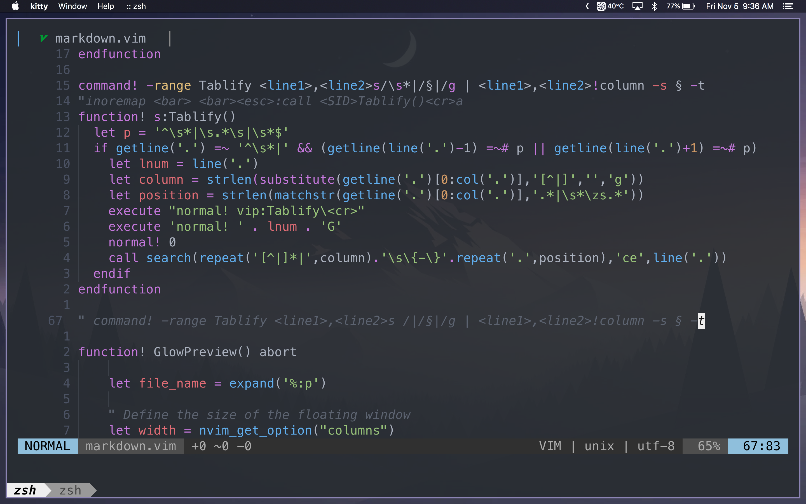
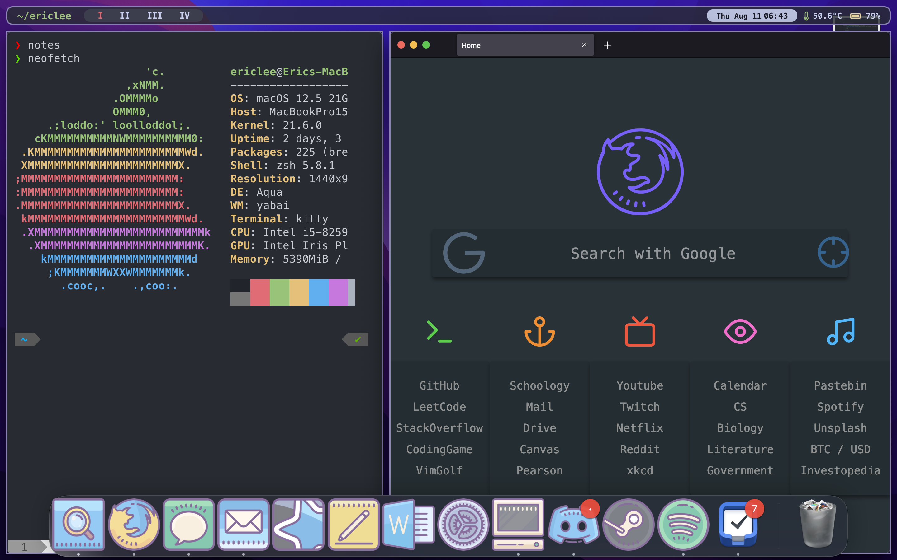

# Eric Lee's Dotfiles

Personalized Dotfiles for MacOS with Yabai and Neovim. Shortcuts managed with [skhd](https://github.com/koekeishiya/skhd), [karabiner-elements](https://karabiner-elements.pqrs.org/), [Alfred](https://www.alfredapp.com/)

## Terminal Workflow

[Neovim](https://github.com/neovim/neovim) is my editor of choice, due to customizability, Native LSP, universal versatility, and performance. [Kitty](https://github.com/kovidgoyal/kitty) is my choice of terminal emulator, as it is much faster than iTerm. Terminal theme is [powerlevel10k](https://github.com/romkatv/powerlevel10k) with zsh.

Neovim Installation

- Copy `.config/nvim` to machine
- Run `nvim +PackerSync` to install packages
- `:Mason` to install LSPs, `:TSInstall <Lang>` to install parsers

Neovim Features

- Notetaking configuration with LaTeX or Markdown
- Simple and quick LSP configuration and installer
- <50ms startup time (On M1 Macbook)

## Window Management

Window management utilizes [yabai](https://github.com/koekeishiya/yabai) and [skhd](https://github.com/koekeishiya/skhd). [sketchybar](https://github.com/FelixKratz/SketchyBar) creates a simple bar above, with easily configurable modules.
