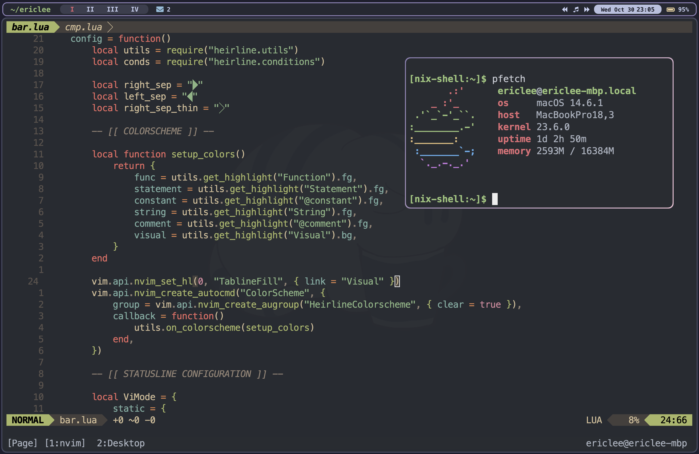

<div align="right">
  <details>
    <summary >🌐 Language</summary>
    <div>
      <div align="center">
        <a href="https://openaitx.github.io/view.html?user=ericlovesmath&project=dotfiles&lang=en">English</a>
        | <a href="https://openaitx.github.io/view.html?user=ericlovesmath&project=dotfiles&lang=zh-CN">简体中文</a>
        | <a href="https://openaitx.github.io/view.html?user=ericlovesmath&project=dotfiles&lang=zh-TW">繁體中文</a>
        | <a href="https://openaitx.github.io/view.html?user=ericlovesmath&project=dotfiles&lang=ja">日本語</a>
        | <a href="https://openaitx.github.io/view.html?user=ericlovesmath&project=dotfiles&lang=ko">한국어</a>
        | <a href="https://openaitx.github.io/view.html?user=ericlovesmath&project=dotfiles&lang=hi">हिन्दी</a>
        | <a href="https://openaitx.github.io/view.html?user=ericlovesmath&project=dotfiles&lang=th">ไทย</a>
        | <a href="https://openaitx.github.io/view.html?user=ericlovesmath&project=dotfiles&lang=fr">Français</a>
        | <a href="https://openaitx.github.io/view.html?user=ericlovesmath&project=dotfiles&lang=de">Deutsch</a>
        | <a href="https://openaitx.github.io/view.html?user=ericlovesmath&project=dotfiles&lang=es">Español</a>
        | <a href="https://openaitx.github.io/view.html?user=ericlovesmath&project=dotfiles&lang=it">Italiano</a>
        | <a href="https://openaitx.github.io/view.html?user=ericlovesmath&project=dotfiles&lang=ru">Русский</a>
        | <a href="https://openaitx.github.io/view.html?user=ericlovesmath&project=dotfiles&lang=pt">Português</a>
        | <a href="https://openaitx.github.io/view.html?user=ericlovesmath&project=dotfiles&lang=nl">Nederlands</a>
        | <a href="https://openaitx.github.io/view.html?user=ericlovesmath&project=dotfiles&lang=pl">Polski</a>
        | <a href="https://openaitx.github.io/view.html?user=ericlovesmath&project=dotfiles&lang=ar">العربية</a>
        | <a href="https://openaitx.github.io/view.html?user=ericlovesmath&project=dotfiles&lang=fa">فارسی</a>
        | <a href="https://openaitx.github.io/view.html?user=ericlovesmath&project=dotfiles&lang=tr">Türkçe</a>
        | <a href="https://openaitx.github.io/view.html?user=ericlovesmath&project=dotfiles&lang=vi">Tiếng Việt</a>
        | <a href="https://openaitx.github.io/view.html?user=ericlovesmath&project=dotfiles&lang=id">Bahasa Indonesia</a>
        | <a href="https://openaitx.github.io/view.html?user=ericlovesmath&project=dotfiles&lang=as">অসমীয়া</
      </div>
    </div>
  </details>
</div>

# Eric Lee's Dotfiles



- Dual configuration for MacOS and Fedora
- Personal [Neovim](https://github.com/neovim/neovim) configuration
- [Alacritty](https://github.com/alacritty/alacritty) with `zsh`

## Installation (MacOS)

- Overview: [yabai](https://github.com/koekeishiya/yabai) + [skhd](https://github.com/koekeishiya/skhd) + [karabiner-elements](https://karabiner-elements.pqrs.org/)

    - Dotfiles symlinked & applications installed with [nix-darwin](github.com/LnL7/nix-darwin) and home-manager
    - Yabai: Tiling WM uses Capslock as a `meh/hyper` global prefix, mimicking vim keybindings
    - Neovim: `Lazy` to install packages, `Mason` to install LSPs
    - Alacritty: Keybindings set such that intuitive `cmd + _` key combinations works with `tmux`

- [Nix](https://github.com/DeterminateSystems/nix-installer): Mostly just used as a declarative package manager and symlink tool

    - If Nix is not an option, see contents of `home-darwin.nix` and `brew.nix` to see symlinks
- Install [Nix]

```bash
mkdir ~/dotfiles & cd ~/dotfiles
git clone https://github.com/ericlovesmath/dotfiles.git ~/dotfiles
nix run nix-darwin -- switch --flake "$HOME/dotfiles\#macos"
```

## Installation (Fedora, Sway and Hyprland)

See `INSTALLATION_GUIDE.md`, tested on the AMD Framework 13 Laptop
